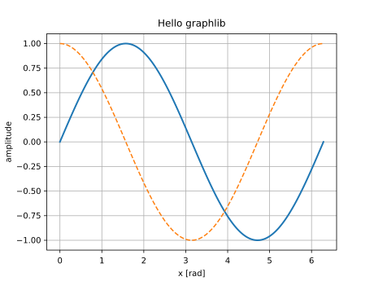
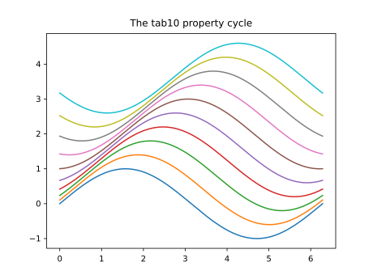
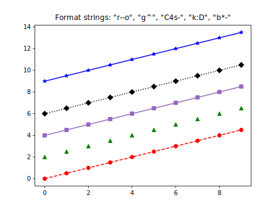
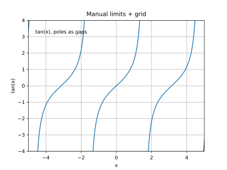
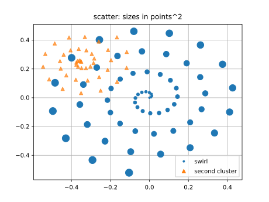
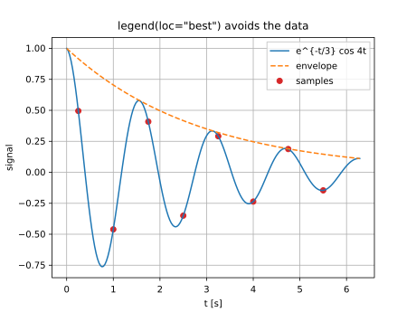
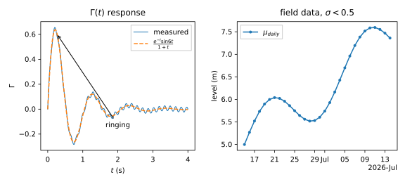
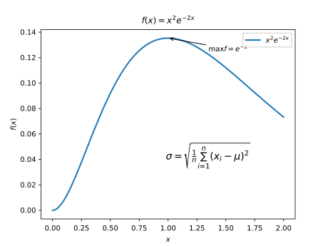
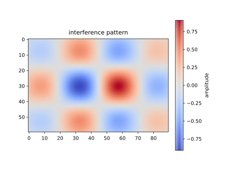
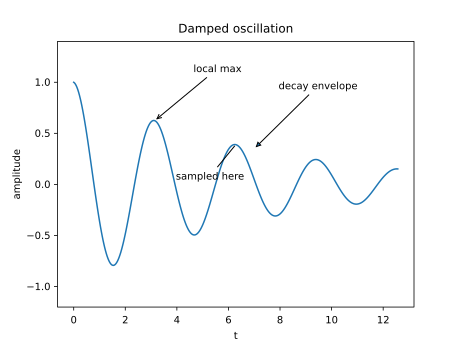

# graphlib

**A modern C++20 plotting library that mimics [matplotlib](https://matplotlib.org/stable/) —
same names, same defaults, same look.**

If you know `import matplotlib.pyplot as plt`, you already know graphlib:

```cpp
#include <graphlib/pyplot.hpp>
#include <graphlib/util.hpp>
namespace plt = graphlib::pyplot;

int main() {
    const auto x = graphlib::linspace(0.0, 2.0 * std::numbers::pi, 200);
    std::vector<double> y(x.size());
    for (size_t i = 0; i < x.size(); ++i) y[i] = std::sin(x[i]);

    plt::plot(x, y, {.linewidth = 2.0, .label = "sin(x)"});
    plt::title("Hello graphlib");
    plt::xlabel("x [rad]");
    plt::grid(true);
    plt::savefig("hello.svg");
}
```



Same tab10 colors, same tick algorithm (a faithful port of `MaxNLocator`), same 5% margins,
same dash patterns, same label formatting — pinned by oracle fixtures generated from
matplotlib itself.

| | | |
|---|---|---|
|  |  |  |

| | |
|---|---|
|  |  |

| | |
|---|---|
|  |  |
|  |  |

## Status: v0.7 "Fast Path"

**Fast**: matplotlib's path simplification and marker stamping ported — a 10M-point
line saves to PNG in ~270 ms, a 1M-point scatter draws in ~190 ms, with a benchmark
regression gate in CI. **SVG, PNG and PDF output** — the PDF is vector,
byte-deterministic, with selectable text (embedded DejaVu, CID-keyed) — plus **mathtext** (`$\frac{a}{b}$`, scripts, greek,
`\sum` limits, `\sqrt`) in every text element, **date axes** (`AutoDateLocator` +
`ConciseDateFormatter` on `std::chrono`), and **`annotate`** with matplotlib's arrow
styles. Underneath: the everyday workhorses (`plot`/`scatter`/`bar`/`hist`/
`fill_between`/`errorbar`/`step`/`pie`, spans), `subplots` + `GridSpec` with sharing and
twins, `tight_layout`, log scales with minor ticks, `legend(loc="best")`, rcParams +
style sheets, and the 2D field tools (**`imshow`, `pcolormesh`, `contour`/`contourf`,
`colorbar`**) with oracle-exact colormaps. Interactive GLFW windows with pan/zoom and
`FuncAnimation` behind `-DGRAPHLIB_INTERACTIVE=ON`.
Tick, autoscale, date and colormap algorithms are faithful ports pinned by fixtures
generated from matplotlib itself. See [ROADMAP.md](ROADMAP.md) for the ladder to 1.0 and
[docs/PARITY.md](docs/PARITY.md) for coverage.

Zero mandatory dependencies. Platforms: macOS (arm64), Linux (x86_64, arm64),
Windows (x86_64, arm64).

## Build & play

```bash
git clone <this repo> && cd graphlib
cmake --preset release && cmake --build --preset release
./build/release/examples/01_hello_lines   # -> hello.svg, open in any browser
```

Or consume from your own CMake project — three ways, all ending in
`target_link_libraries(your_app PRIVATE graphlib::graphlib)`:

```cmake
# 1. FetchContent
include(FetchContent)
FetchContent_Declare(graphlib
    GIT_REPOSITORY https://github.com/Nosenzor/graphlib.git GIT_TAG v1.0.0)
FetchContent_MakeAvailable(graphlib)
```

```bash
# 2. Install + find_package
cmake --preset release && cmake --build --preset release
cmake --install build/release --prefix /your/prefix
# then in your project: find_package(graphlib 1.0 REQUIRED) with CMAKE_PREFIX_PATH=/your/prefix
```

```bash
# 3. vcpkg (overlay port, in-repo until the registry submission lands)
vcpkg install graphlib --overlay-ports=path/to/graphlib/ports
```

Tests (`ctest --preset dev`) compare against committed matplotlib-oracle fixtures and golden
SVG baselines. Contributor guide: [AGENTS.md](AGENTS.md). Architecture:
[docs/DESIGN.md](docs/DESIGN.md).

## License

[MIT](LICENSE)
